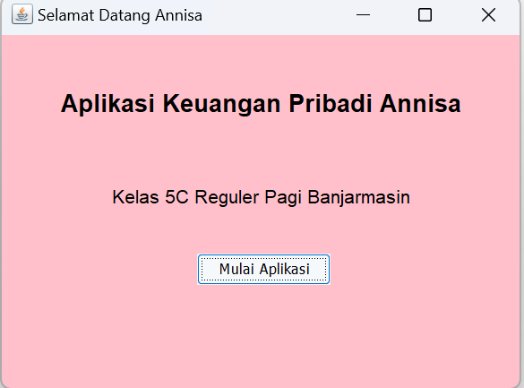
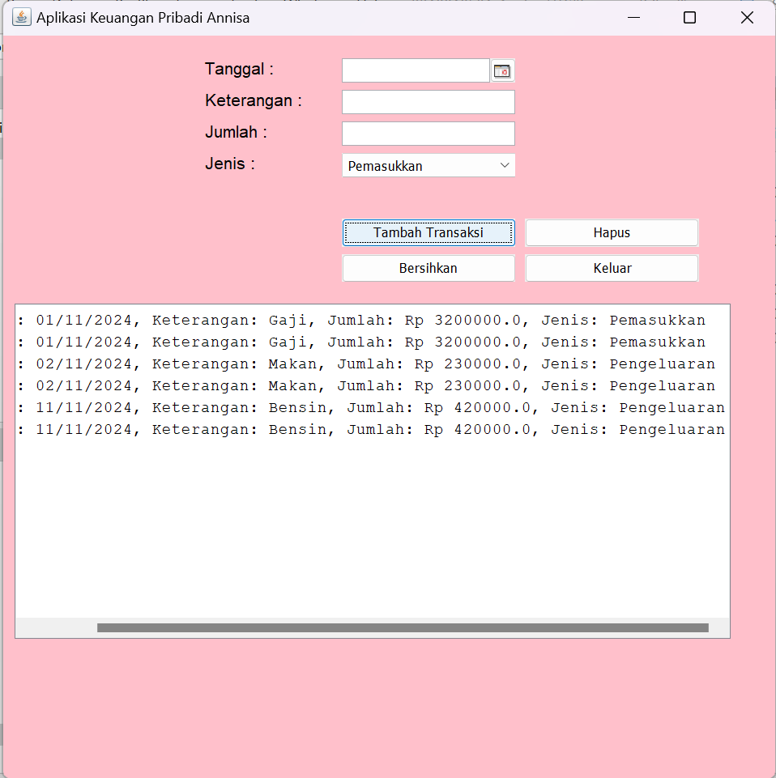

# UTSKeuanganPribadi
 Annisa - 2210010581 -UTS
 
# Aplikasi Keuangan Pribadi
 
Aplikasi Keuangan Pribadi adalah aplikasi untuk mendata uang pemasukkan dan pengeluaran

# Keunggulan Aplikasi

- Keuangan pribadi : terhubung ke database sqlite

# Pembuat Aplikasi
 Annisa - 2210010581 - UTS

# Fitur

Aplikasi ini menawarkan fitur:

Keuangan pribadi

## Cara Menjalankan
Halaman Awal
1. Run File
2. Tekan Button Mulai Aplikasi untuk menjalankan program 
Aplikasi Utama
1. Pilih Tanggal yang akan diinput
2. Ketik keterangan di text field
3. Ketik jumlah angka berapa yang diinput
4. Pilih jenisnya pemasukkan atau pengeluaran di combobox
5. Tekan Button Tambah transaksi, maka akan keluar hasil di text area
6. Tekan Button bersihkan untuk mengulang dan membersihkan text area
7. Tekan Button hapus untuk menghapus databasenya dan di text area
8. Tekan Button keluar, jika ingin keluar 

# Demo
 Halaman Awal
 Aplikasi Utama

